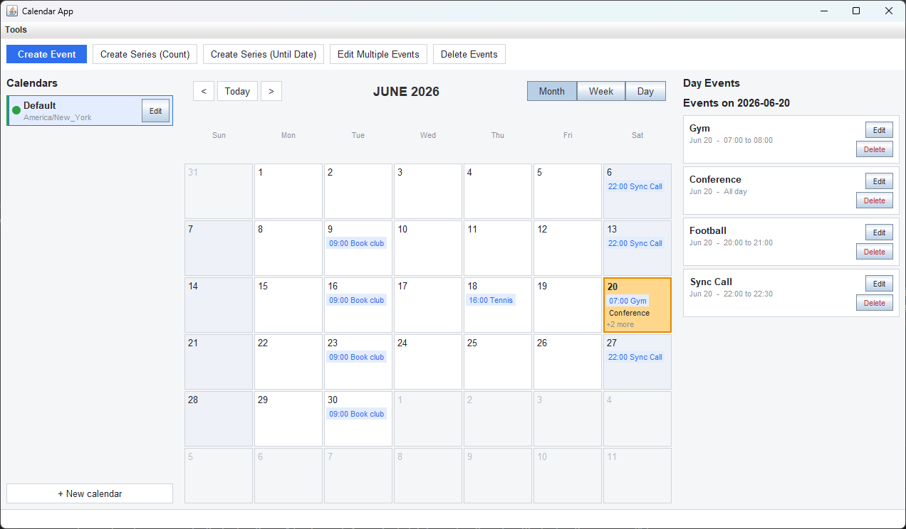
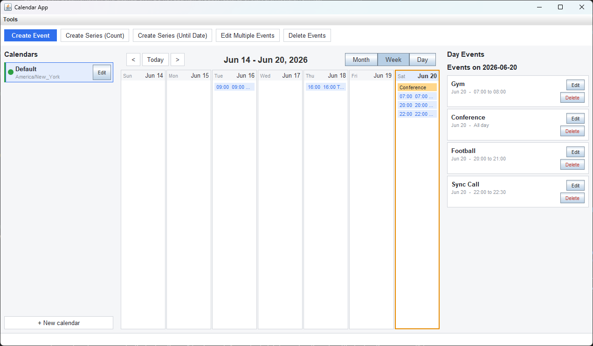
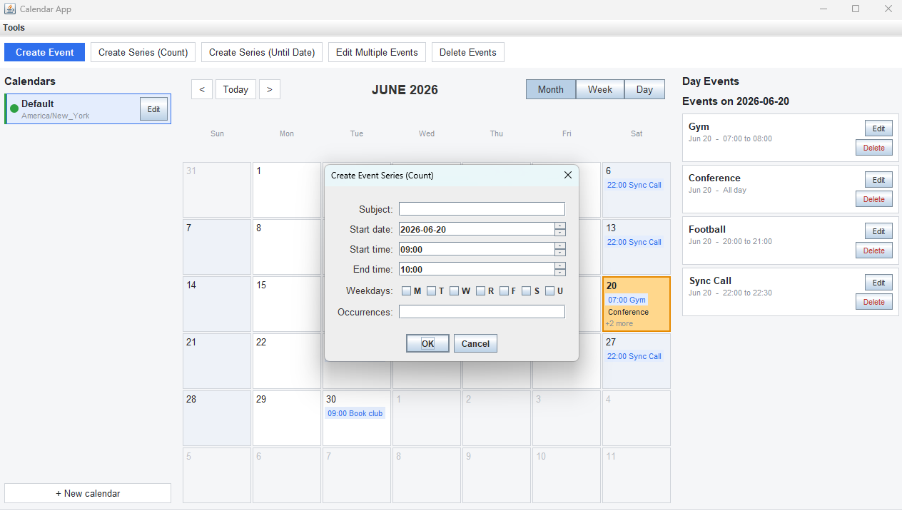
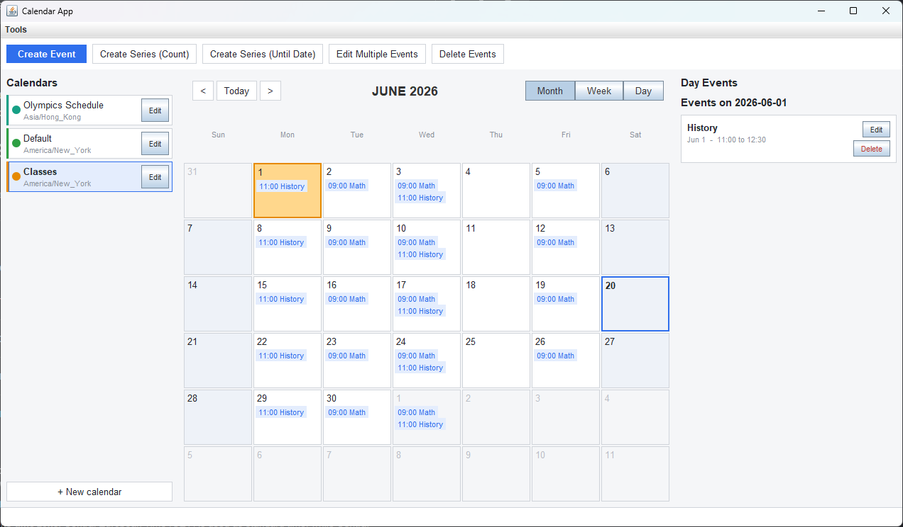

# Calendar App

A polished **Java desktop calendar application** with three interaction modes — a Swing GUI, an
interactive command-line REPL, and a headless command-file runner — built on a clean
Model–View–Controller architecture.

It supports multiple calendars, IANA timezones, recurring event series, month/week/day views,
CSV and iCalendar export, and local persistence, and is backed by a strong test and quality-gate
setup (JUnit, JaCoCo, Checkstyle, PIT).

- **Language / build:** Java 11, Gradle (wrapper included)
- **Runtime dependencies:** none (JDK only)
- **Tests:** 440+ JUnit tests, with coverage (JaCoCo), style (Checkstyle, zero-warning gate), and
  mutation testing (PIT)

---

## Run the demo

**Requirements:** JDK 11+ on your `PATH`. No separate Gradle install is needed — use the bundled
wrapper (`./gradlew` on macOS/Linux/Git Bash, `gradlew.bat` on Windows `cmd`/PowerShell).

```bash
# 1. Clone and enter the project
git clone <repository-url>
cd calendar-app

# 2. Launch the GUI (quickest path)
./gradlew run
```

The GUI opens with a default calendar; events you create are saved locally and restored next launch.

### Build a runnable JAR and use the other modes

```bash
./gradlew jar                                  # builds build/libs/calendar-1.0.jar

java -jar build/libs/calendar-1.0.jar          # GUI (default)
java -jar build/libs/calendar-1.0.jar --mode interactive                 # text REPL
java -jar build/libs/calendar-1.0.jar --mode headless res/demo_commands.txt   # scripted demo
```

The headless command above seeds two calendars (in different timezones) with a recurring standup,
several meetings, an all-day event, and a multi-day event, prints a date range, and exports a CSV.

### Run the tests and quality checks

```bash
./gradlew test                       # JUnit suite (+ JaCoCo report under build/reports/jacoco)
./gradlew checkstyleMain checkstyleTest   # style gate (fails on any warning)
./gradlew build                      # full compile + checkstyle + tests
./gradlew pitest                     # optional: mutation testing (slower)
```

---

## Highlights

- **Three front-ends, one core.** A GUI, an interactive REPL, and a headless command-file runner all
  drive the same UI-independent model — a concrete demonstration of MVC separation.
- **Multi-calendar + timezones.** Create multiple calendars, each with its own IANA timezone; copy
  events between them with correct timezone conversion.
- **Month / Week / Day views.** A unified calendar surface with event chips, a day-detail panel, and
  clear today/selected/weekend styling.
- **Recurring event series.** Create, edit, and delete by single occurrence, "this and later," or the
  whole series.
- **First-class all-day events** and **busy/free status** queries.
- **CSV and iCalendar export** in a format that imports cleanly into Google Calendar.
- **Local persistence.** GUI state is saved to a small local file and restored on the next launch.
- **Keyboard shortcuts & accessibility.** Ctrl+N/T/E, Ctrl+arrows, Ctrl+1/2/3, plus accessible names
  on the main controls.
- **Quality gates.** Zero-warning Checkstyle, JaCoCo coverage, and PIT mutation testing, with a build
  that fails on test failures.

---

## Screenshots







---

## Demo script

After launching the GUI (`./gradlew run`):

1. **Browse the month.** Event indicators (chips) appear on days with events; click a day to see its
   events as cards in the right-hand panel.
2. **Switch views.** Use the **Month / Week / Day** buttons or **Ctrl+1 / Ctrl+2 / Ctrl+3**; navigate
   periods with **< / Today / >** or **Ctrl+Left / Ctrl+T / Ctrl+Right**.
3. **Create an event.** Click **Create Event** (or **Ctrl+N**), pick a date/time, and try the
   **All-day** option. Create a recurring series with the series buttons.
4. **Add a calendar.** Use **+ New calendar** in the sidebar, give it a different timezone, and switch
   between calendars (each gets its own color marker and timezone subtitle).
5. **Use the Tools menu.** Export to CSV/ICS, copy events between calendars, check busy/free status,
   and view a date range (results render in the detail panel).
6. **Show persistence.** Close the window and relaunch — your calendars and events are restored.

For a populated starting point without clicking, run the headless demo file first:
`java -jar build/libs/calendar-1.0.jar --mode headless res/demo_commands.txt`.

A more detailed GUI walkthrough lives in [USEME.md](USEME.md).

---

## Architecture overview

The application follows **Model–View–Controller**, with the model fully decoupled from any UI or I/O
so the same core powers all three run modes.

```
CalendarRunner                      entry point; selects GUI / interactive / headless mode
        |
        v
calendar.controller                 parsing, command dispatch, GUI callbacks, persistence, export
  - CalControllerImpl               text-mode driver (interactive + headless)
  - BetterParser / CommandParser    regex command parsing
  - *Command classes                one focused class per operation (create/edit/delete/copy/...)
  - Features / GuiControllerImpl     callback seam between the GUI and the model
  - Export                          CSV + iCalendar writers
  - CalendarStore                   local file persistence (load/save)
        |
        v
calendar.model                      pure domain — no UI or I/O imports
  - Event (+ Builder), enums        immutable events; EventLocation / EventStatus / EventProperty
  - CalModelImpl                    event storage, series generation, range queries
  - SingleCalModelImpl              a calendar with a timezone (transactional timezone changes)
  - MultiCalModelImpl               many named calendars + cross-calendar copy
        ^
        |
calendar.view                       presentation
  - CalViewImpl                     text output
  - CalGuiImpl + panels             Swing GUI: sidebar, month/week/day surface, detail panel,
                                    dialogs, toolbar, menu bar, status strip, theme/factories
```

Design notes worth calling out:

- **All-day events are a first-class concept** (an explicit flag, not inferred from times); CSV/ICS
  export keys off this flag.
- **Event identity is subject + start + end**, used consistently for duplicate detection, edits,
  copies, and deletes.
- **Timezone changes are transactional** — events are converted as a set and swapped in atomically,
  or not at all.
- **The GUI is decomposed** into focused components behind a thin shell, coordinated through the
  `Features` callback interface, which keeps the view swappable without touching the domain.

---

## Features

Calendar-level:
- Create, rename, and re-timezone calendars; switch the active calendar; list calendars.
- Copy events between calendars (single event, a day, or a date range) with timezone conversion.

Event-level:
- Create timed or all-day events; create recurring series by **count** or **until** a date.
- Edit a single event, "this and later in the series," or the whole series.
- Delete a single event, "this and later," or the whole series.
- Query events for a day or a date range; check busy/free status for a date-time.

Export & persistence:
- Export a calendar to **CSV** (Google Calendar format) or **iCalendar (.ics)**.
- Local persistence of calendars and events for the GUI.

Most features are available in all three modes. A few are mode-specific: the clickable month grid,
the calendar list, and default-calendar-on-start are GUI conveniences, while single-event and
single-day copy are exposed in the text modes.

---

## Command reference (text modes)

Used in interactive and headless modes. `<dateString>` is `YYYY-MM-DD`; `<dateTime>` is
`YYYY-MM-DDThh:mm`. Multi-word subjects must be wrapped in double quotes.

```text
# Calendars
create calendar --name <calName> --timezone <Area/Location>
edit calendar --name <name> --property <name|timezone> <newValue>
use calendar --name <name>

# Events
create event <subject> from <dateTime> to <dateTime>
create event <subject> on <dateString>                                   # all-day
create event <subject> from <dateTime> to <dateTime> repeats <weekdays> for <N> times
create event <subject> from <dateTime> to <dateTime> repeats <weekdays> until <dateString>
edit event   <property> <subject> from <dateTime> to <dateTime> with <newValue>
edit events  <property> <subject> from <dateTime> with <newValue>        # this + later in series
edit series  <property> <subject> from <dateTime> with <newValue>        # whole series
delete event <subject> from <dateTime> to <dateTime>
delete events <subject> from <dateTime>                                  # this + later in series
delete series <subject> from <dateTime>                                  # whole series

# Queries, copy, export
print events on <dateString>
print events from <dateTime> to <dateTime>
show status on <dateTime>
copy event <subject> on <dateTime> --target <calendar> to <dateTime>
copy events on <dateString> --target <calendar> to <dateString>
copy events between <dateString> and <dateString> --target <calendar> to <dateString>
export cal <fileName>.csv
export cal <fileName>.ics
exit
```

Weekday codes for series: `M` Mon, `T` Tue, `W` Wed, `R` Thu, `F` Fri, `S` Sat, `U` Sun
(e.g. `MWF`). `<property>` is one of `subject`, `start`, `end`, `description`, `location`, `status`.

---

## Testing & quality

- **JUnit 4** unit/integration tests across the model, controller, parser, persistence, and view
  helpers (440+ tests).
- **JaCoCo** coverage reports (`build/reports/jacoco`).
- **Checkstyle** with a strict, zero-warning gate (`config/checkstyle/checkstyle.xml`).
- **PIT** mutation testing to validate test effectiveness.
- The Gradle `test` task fails the build on any test failure.

```bash
./gradlew build        # compile + checkstyle + tests
./gradlew pitest       # optional mutation testing
```

---

## Project status

**Complete — archived as a portfolio project.** The application is feature-complete for its scope
and stable; it is not under active development.

Possible future directions (not in progress): a relational store such as SQLite for richer
persistence, a JavaFX or web (React) front-end over the existing model, rule-based recurrence
(RRULE) with exceptions, iCalendar import, and optional cloud sync. These are noted only to show
where the architecture could extend; the current repository is the finished artifact.

---

## Repository layout

```
src/main/java/CalendarRunner.java     entry point
src/main/java/calendar/model          domain model (no UI/IO)
src/main/java/calendar/controller     parsing, commands, persistence, export, GUI callbacks
src/main/java/calendar/view           text view + Swing GUI
src/test/java                         JUnit tests mirroring the package layout
res/                                  sample command files, class diagrams, GUI images
config/checkstyle                     Checkstyle ruleset
```

See [USEME.md](USEME.md) for a detailed GUI walkthrough and the full keyboard-shortcut list.

---

## Acknowledgements

Originally built as a two-person project for the Programming Design Paradigms course at Northeastern
University, then extended and polished into this portfolio version.
