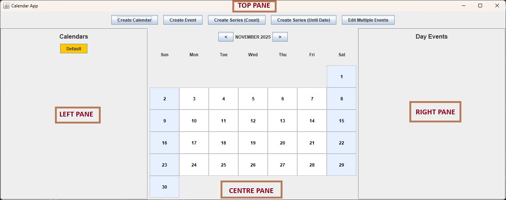
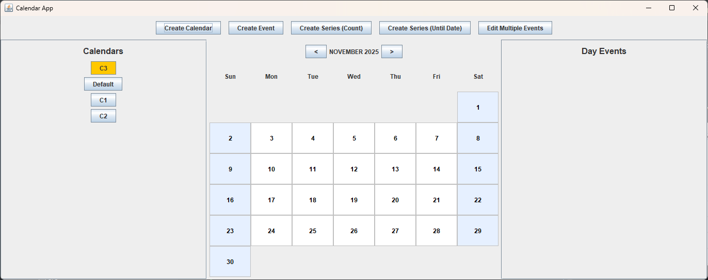
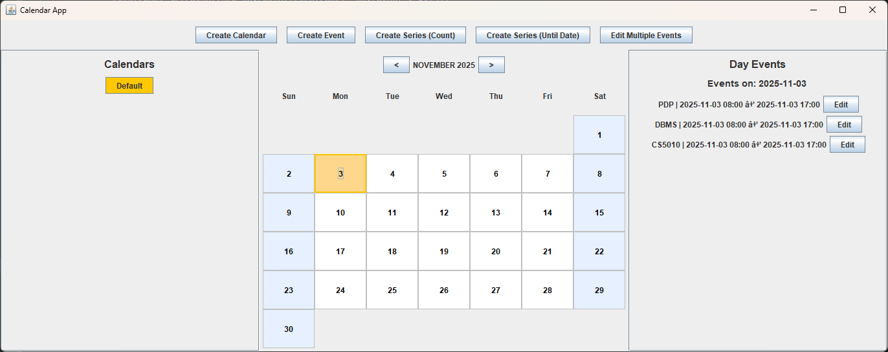
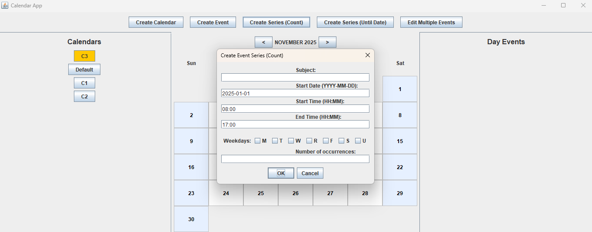

#### This document explains how to run the **Calendar Application** by building and using the JAR file.

---
## Building the JAR file:
To build the JAR file, run:
```bash
./gradlew jar
```
This will create a JAR file in the `build/libs` directory


## Running the Application:
### 1. GUI Mode (Default)  
The GUI mode allows you to interact with the application through a Graphical User Interface.  
Operating the GUI: [**Link**](#how-to-use-the-gui)

**Command:**  
```bash
java -jar <JAR path>.jar
```
**Instructions on how to use the GUI are [here](#how-to-use-the-gui)**


### 2. Interactive Mode
The interactive mode allows you to enter commands manually through the terminal.

**Command:**
```bash
java -jar <JAR path>.jar --mode interactive
```
You will then be prompted to enter calendar commands directly (e.g., creating, editing, or printing events).  
To exit, use the "Exit" command.


### 3. Headless Mode   
In headless mode, the program reads commands from a text file instead of user input.

**Command:**
```bash
java -jar <JAR path>.jar --mode headless <filename.txt>
```
Example:
```bash
java -jar <JAR path>.jar --mode headless res/sample_commands.txt
```
Here, `sample_commands.txt` should contain valid commands, one per line. The application will execute them sequentially and print the results to the console.

---
### Example Runs:
**Example 1:**
```bash
java -jar build/libs/calendar-1.0.jar
```
Starts in GUI mode (default)  

**Example 2:**
```bash
java -jar build/libs/calendar-1.0.jar --mode interactive
```
Starts in interactive mode  

**Example 3:**
```bash
java -jar build/libs/calendar-1.0.jar --mode headless res/sample_commands.txt
```
Executes all commands in `sample_ommands.txt` and displays the output in the terminal.  

---


## How to use the GUI

The window has a top action toolbar, a calendars sidebar (left), the month surface (center), a day
detail panel (right), a **Tools** menu, and a status strip along the bottom for feedback. (The
screenshots below predate the latest visual refresh and are kept for general orientation.)



### Calendars sidebar (left):
- Lists the available calendars; the active one is highlighted.
- By default, when the application is run, a "Default" calendar is created and made active.
- Selecting a calendar makes it active and updates the month surface and day panel.


### Day detail panel (right):
- Shows the events for the selected day as cards, each with the subject, time (or "All day"),
  location/status when present, and inline **Edit** and **Delete** actions.
- **Delete** asks for confirmation before removing that single event.
- This panel is also used to present the results of a **View Date Range** query.


### Month surface (center):
- A six-week month grid. Use **<** / **>** to change month and **Today** to jump back to the
  current month and select today.
- Days with events show event chips (with a "+N more" indicator when there are several).
- Today is outlined, the selected day is highlighted, weekends are tinted, and days outside the
  displayed month are muted. Clicking a day shows its events in the day panel.

### Top action toolbar:
- Holds the main actions: Create Calendar, Create Event, Create Series (Count),
  Create Series (Until Date), Edit Multiple Events, and Delete Events.
- The create/edit dialogs are forms with **date and time pickers** and inline validation, so dates
  and times no longer need to be typed by hand. Fields default to the selected day (or today).
- The Create Event dialog has an **All-day event** checkbox; when ticked, the time fields are
  ignored and a first-class all-day event is created.
- **Edit Multiple Events** and **Delete Events** let you apply a change to an entire series, or to
  an event and all later events in its series, using the scope option in the dialog.


### Status strip (bottom):
- Routine successes and one-shot results (such as a busy/available check) appear briefly here
  rather than in a pop-up. Validation problems and errors are still shown in a dialog.

### Tools Menu
The **Tools** menu (in the menu bar) provides access to features that are also available in the
text modes:
- **Edit Calendar** — rename a calendar or change its timezone.
- **Export to CSV / Export to ICS** — export the active calendar to a file.
- **Copy Events** — copy a range of events from the active calendar into another calendar.
- **Show Status** — check whether you are busy or available at a given date and time.
- **View Date Range** — list all events of the active calendar within a date/time range.

### Example flow:

1. Run the application in GUI mode (no arguments).  
2. A calendar is created and selected: "Default".  
3. Create another calendar if you want to, or proceed to creating events/event series. Creating a calendar automatically
sets that calendar as active (the highlight moves to the created calendar).  
4. Create an event by clicking one of the create event/series buttons and choosing the date and
time with the pickers. Selecting a day in the month grid first pre-fills the date fields. Tick
**All-day event** in the Create Event dialog to create an all-day event.
5. View the events for a day on the right pane.
6. Edit a particular event if needed, or edit multiple events using the top action pane button.
7. The edition is reflected in the right pane on the correct day.
8. Switch to a different calendar if needed by clicking on it.
9. Close the window to quit the program.